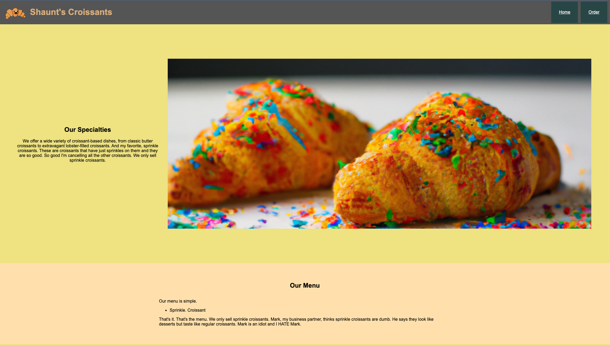
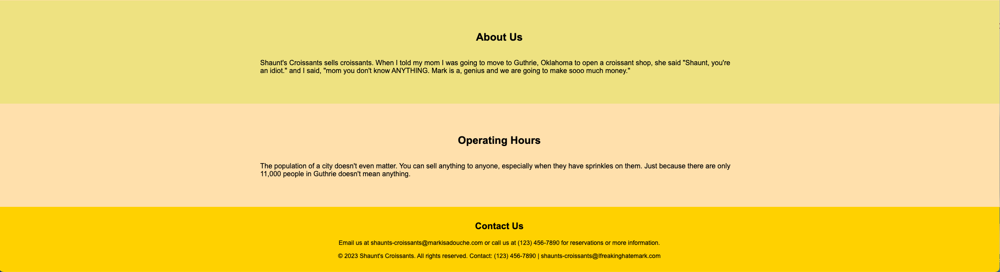
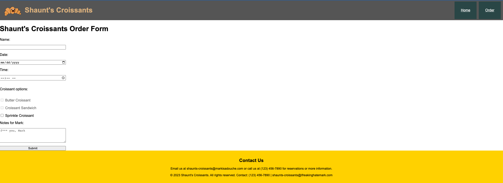

# HTML Multi-Page Website

## Overview

Create a website with multiple pages using HTML and CSS that matches the provided design.

## Requirements / Steps

This website should fit the following criteria:

- [ ] Use semantic HTML tags
- [ ] Both pages should have a header with working navigation
- [ ] Both pages should have a footer
- [ ] Use the images in the provided "assets" folder
- [ ] Organize folders for files and pages

## Design

### Landing Page

### Order Page

